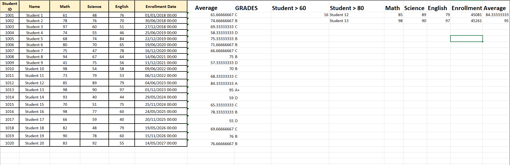
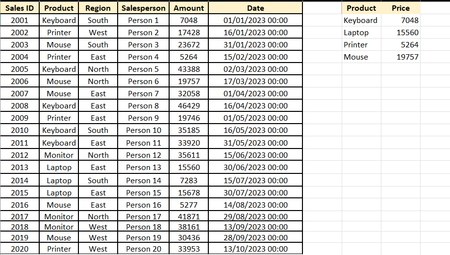
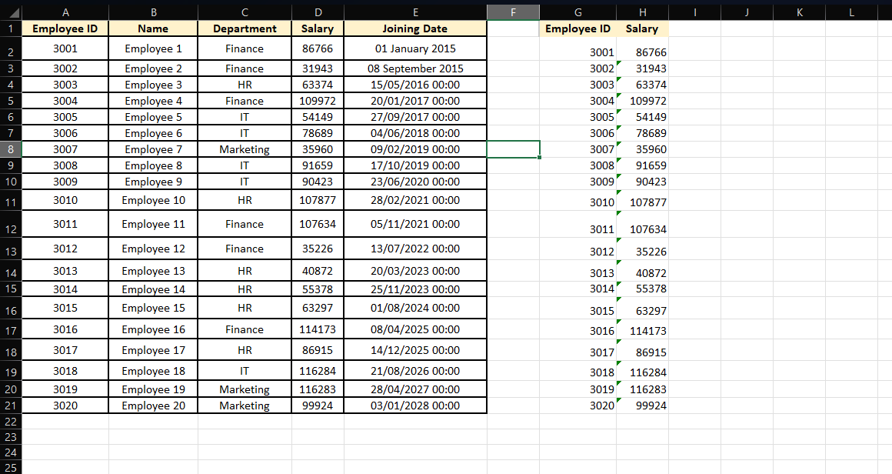

# Excel Data Analysis Project

## Overview

This project demonstrates the use of various Microsoft Excel functions for data analysis, data lookup, filtering, and date analysis.

## Dataset

The workbook contains multiple datasets related to:

* Student Records
* Employee Records
* Sales Records

## Tasks Performed

### 1. Average Calculation

Calculated the average marks of students using the AVERAGE function.

**Formula:**

```excel
=AVERAGE(C2:E2)
```

### 2. Grade Assignment

Assigned grades based on student average marks using IF statements.

**Formula:**

```excel
=IF(G2>=80,"A",IF(G2>=70,"B",IF(G2>=60,"C",IF(G2>=50,"D","F"))))
```

### 3. Count Students Above 60

Counted the number of students scoring above 60 using COUNTIF.

**Formula:**

```excel
=COUNTIF(G2:G21,">60")
```

### 4. VLOOKUP

Retrieved product amounts from sales data using VLOOKUP.

**Formula:**

```excel
=VLOOKUP(H2,B2:E21,4,FALSE)
```

### 5. XLOOKUP

Fetched employee salary information dynamically using XLOOKUP.

**Formula:**

```excel
=XLOOKUP(G2,A2:A21,D2:D21,"Employee Not Found")
```

### 6. Date Analysis

Formatted and analyzed enrollment/joining dates using Excel date functions.

**Functions Used:**

```excel
=YEAR(E2)
=MONTH(E2)
=DATEDIF(E2,TODAY(),"Y")
```

### 7. FILTER Function

Extracted students whose average marks were above 80.

**Formula:**

```excel
=FILTER(B2:G21,G2:G21>80)
```

## Output Screenshots

### Output 1



### Output 2



### Output 3



## Files Included

* Project-1.xlsx
* README.md
* Output Screenshots

## Tools Used

* Microsoft Excel
* GitHub

## Author

Rishit Rajput
